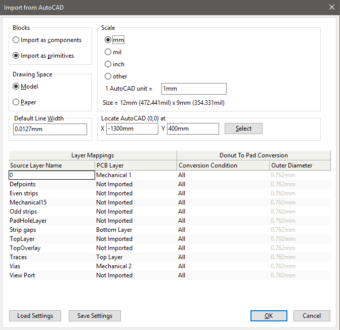
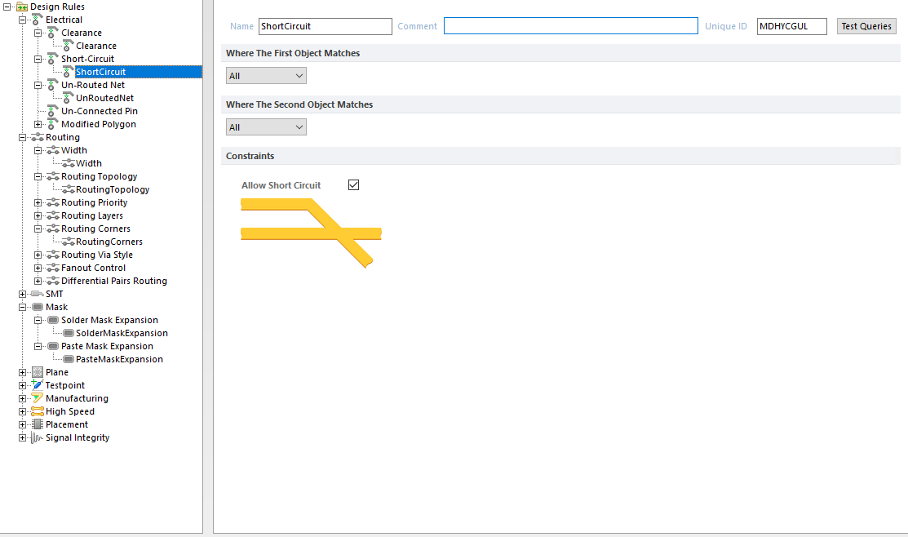
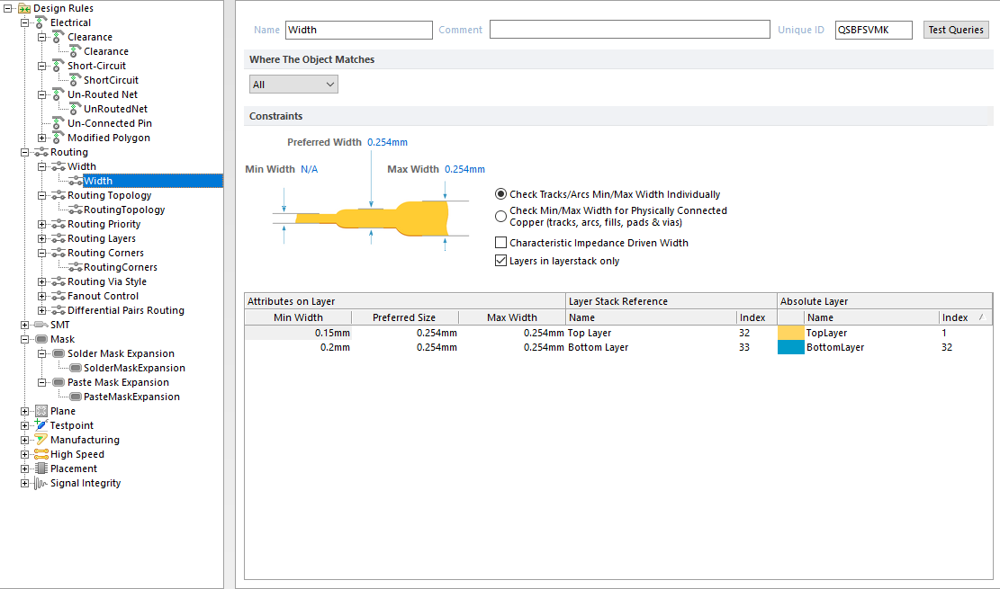
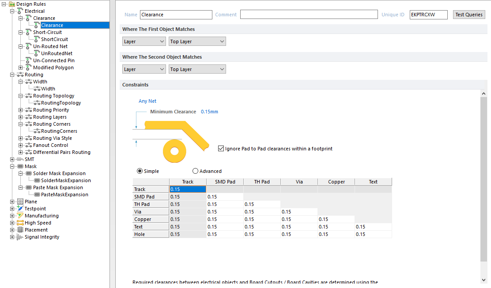
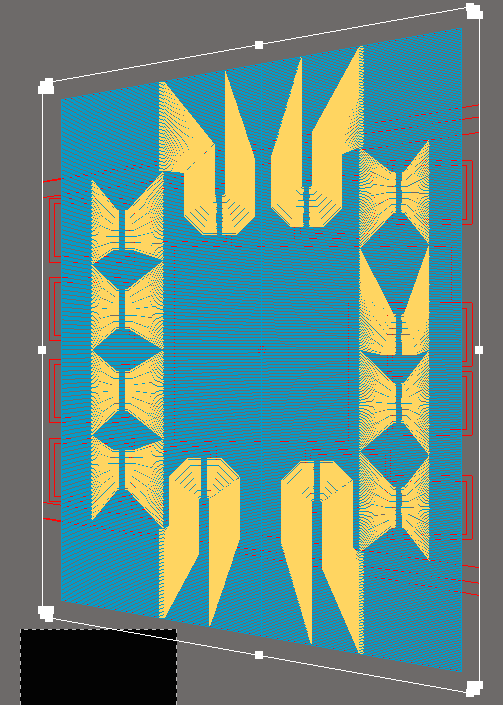
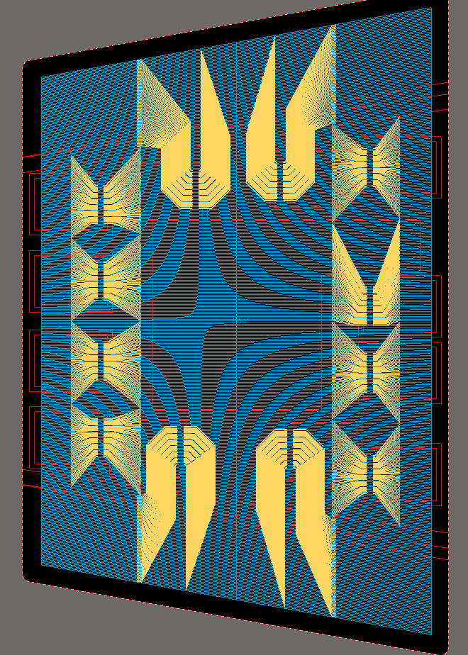
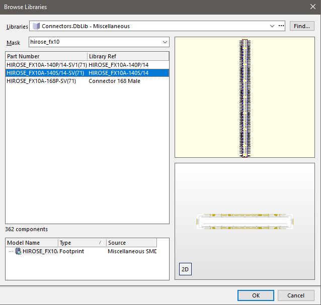
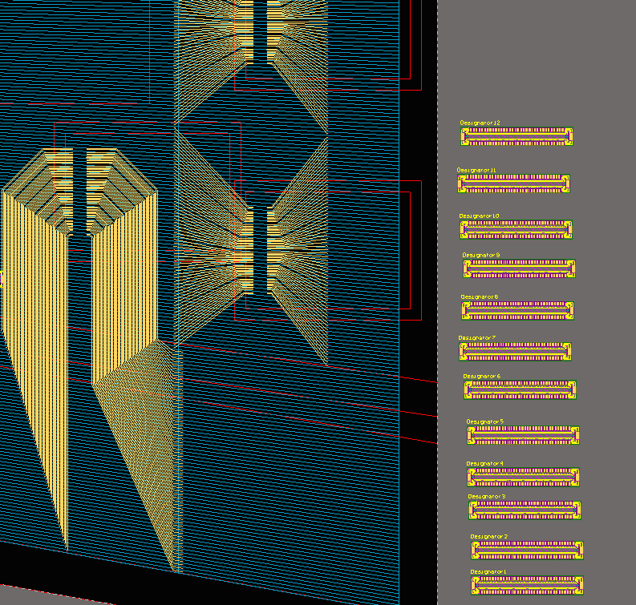

# GEM_scripts

Follow these steps for creating a GE2/1 readout board. 

## Notes

There are a set of holes on each board for mounting and fixation which are usually added by Bertrand (CERN). The inputs for this are not yet described in this guide. Coming soon...

## Step 1. Generating DXF with strip gaps and traces

Generating this DXF is done by the `make_ge21_rob.py` and requires as input a DXF of the outline of the module, the chimney boundary, and the active area. This info is contained in two mechanical drawings for each of the modules, which are produced by Stephane Brachet and stored in the directory `in`. 

With these two input files in hand, the procedure is as follows:

1. The variables `block_label` and `chimney_label` contain the names of the reference blocks in the AutoCAD drawing representing the board outline and chimney. These have already been entered in the script for all the modules, but you should double check them. They can be read off from the input DXFs by double-clicking on the "reference block" representing the module in the drawing and reading its name. 

2. Enter the coordinates of the top two corners of the active area in the `segm_def` list (you only need the top two corners since the board is symmetric around Y=0). These two points can be read off by running `check_dxf.py` on the input DXF `GE21_M#_outline.dxf`, e.g. for module 2: `./check_dxf.py -m 2`. The script will transfer the outline to a new file `out/GE21_M#.dxf`. You can open this and look at the approximate coordinates of the two corners in order to know which numbers to take from the print out.

3. Finally, fill the list `conn_list` with the coordinates and rotation angle for each of the 12 connectors. You can start by just copying the coordinates from a similar module (e.g. take coordinates from M1 as initial guess for M5). Run the script: `./make_ge21_rob.py -m 2`. Considerations for placement of connectors include:
    * connectors must be fully contained within the aluminum bars denoted by dotted lines
    * `> 5 mm` clearance from any other object as well as from the aluminum bars
    * For M1 and M5, `> 20 mm` clearance for connectors 10 and 11 from the aluminum bar for routing of low voltage; for other modules the clearance of `> 20 mm` is needed also for connectors 4 and 5 since the wires will be coming in from the previous module
    * `> 35 mm` clearance for connector 6 and > 20 mm for connector 7 from the aluminum bar for routing fibers
    * `> 23 mm` wide path for routing signals from each GEB/VFAT connector to one of the two GEB/OH connectors, this is not always possible, consult GEB designers if in doubt (for M5, similar choices to M1 should be ok)
    * `> 55 mm` for a master-slave cable (note that cable goes in opposite direction for Master vs Slave modules)

4. Run `make_ge21_rob.py` to obtain the DXF and examine it in AutoCAD. Debug mode shows the different sets of strips in different colors and hides the routing to make it easier to see things when initially deciding on connector placement. 

5. When happy with the positions. Run above with `debug = False` to show the routing. Carefully check if it all looks reasonable and make sure there is no traces that are too close or overlapping; examine also if any traces pass too close to the vias. Clearances of > 20 mm should be sufficient. 

## Step 2. Import DXF into Altium

For installing a script project see here:

1. Open Altium and create new empty PCB project

2. Create a new PCB document 

3. Press `Q` to switch the units to mm

4. Import DXF only:
    * `File > Import > DXF`
    * Select the DXF file 
    * Fill in the pop-up titled `Import from AutoCAD` as follows:

    

    * The AutoCAD origin should be placed such that the board itself is not too far from the Altium origin and also completely contained in positive Y, see GE2/1 M1 here:
    * For simplicity, the traces are not assigned to nets. This means that Altium's default design rules will find violations with all the traces. I disable them as follows:

    
    
    

    * As a result Altium will not be able to detect all possible violations so it's worth checking by eye if any traces look too close. It could be a future improvement to implement the net assignment to make Altium's checks more reliable.

5. Define the board
    * Select the outline as shown on the left, go to `Design > Board Shape > Define from selected objects` - a warning about using external edges may pop, press `Yes`. The result should look like the right pic

    
    

    * Save PCB before continuing.

6. Place 12 connectors next to the board, the exact position is not important, we will move them next. Save PCB (Altium crashes a lot...)

    
    

7. Only the first time making a board, "install" the script in Altium
    * Create a scripting project and add the file `altium/place_comps_ge21_rob.js` to it
    * In order to use this with any board, we install it as a global project: go to `DXP > Preferences`, select `Scripting System > Global Projects`, click on `Install` and select the scripting project you created

8. Placing the vias and moving components to the proper positions
    * open the script `altium/place_comps_ge21_rob.js` for editing
    * replace the functions `CreateViaArray` and `CreateConnectorArray` with those written by the python script `make_ge21_rob.py` in Step 1; these can be found in `via_coord/`*board_name*`_coord.js` (I've tried to make this less clunky, but could not get Altium to open the additional file by itself so far)
    * modify the values for `offset_x` and `offset_y` with the ones you used when placing the AutoCAD origin when importing the DXF
    * run the script by going to `DXP > Run Script` in the pop-up select the function `Main` under `place_comps_ge21_rob.js` and click `OK`
    * Wait... depending on how much RAM you have could be a minute, or a few, until Altium is fully responsive again

9. Export manufacturing outputs
    * Go to `File > Fabrication Outputs > Gerber Files`, choose the units in `mm`, and from the layers select top, bottom and mechanical 1
    * Go to `File > Fabrication Outputs > NC Drill Files`, choose the units in `mm`
